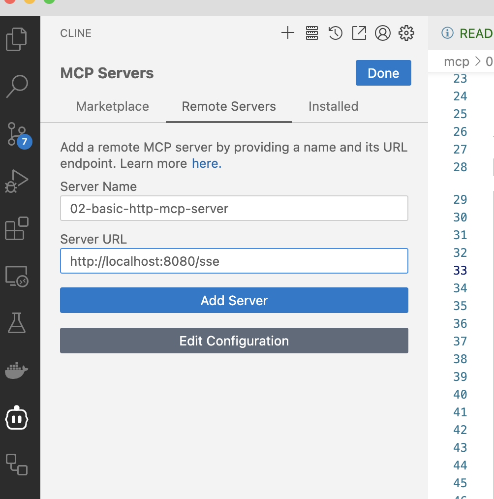
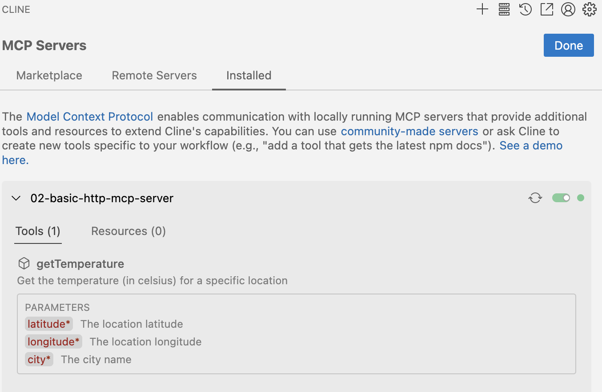
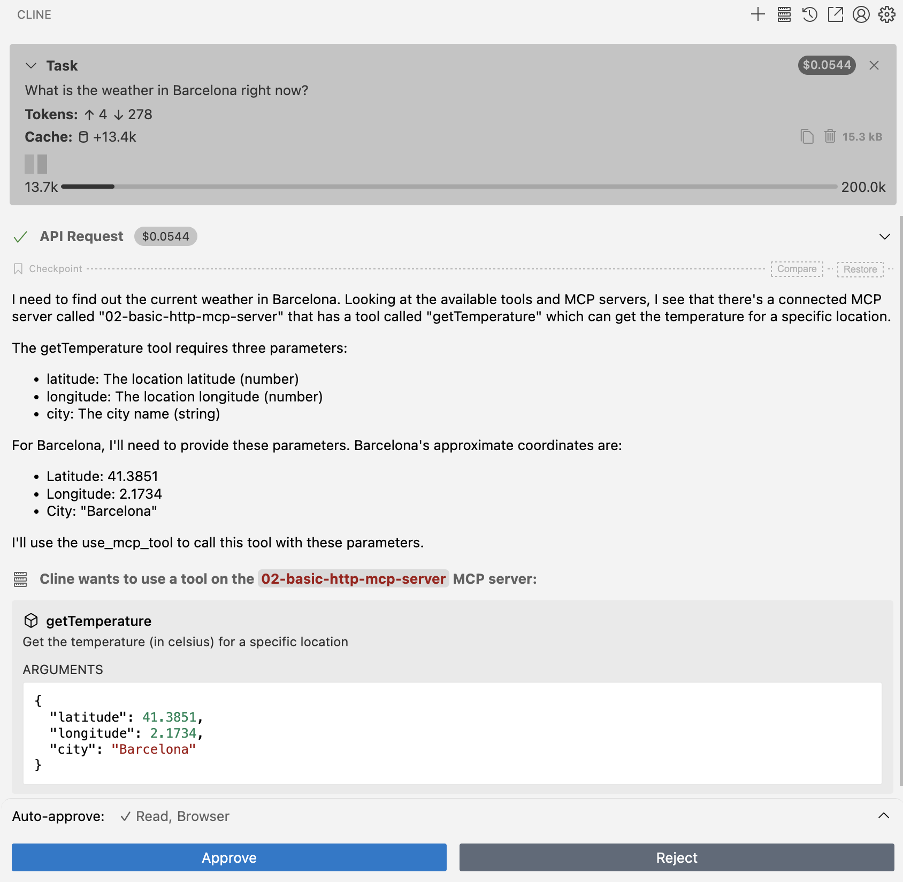

# Spring AI MCP Basic HTTP Server

A Spring Boot starter project demonstrating how to build a Model Context Protocol (MCP) server that provides weather-related tools using the Open-Meteo API. This project showcases the Spring AI MCP Server Boot Starter capabilities with HTTP/SSE transport implementation.

For more information, see the [MCP Server Boot Starter](https://docs.spring.io/spring-ai/reference/api/mcp/mcp-server-boot-starter-docs.html) reference documentation.

## Prerequisites

- Java 17 or later
- Maven 3.6 or later
- Understanding of Spring Boot, Spring WebFlux, and Spring AI concepts
- (Optional) Claude Desktop for AI assistant integration

## About Spring AI MCP Server Boot Starter with WebFlux

The `spring-ai-starter-mcp-server-webflux` provides:
- Automatic configuration of MCP server components
- Support for both synchronous and asynchronous operation modes
- HTTP/SSE transport layer implementation using Spring WebFlux
- Flexible tool registration through Spring beans
- Change notification capabilities

## Project Structure

```
src/
├── main/
│   ├── java/
│   │   └── com/example/
│   │       ├── BasicHttpMcpServerApplication.java    # Main application class with tool registration
│   │       └── WeatherTools.java                     # Weather service implementation with MCP tools
│   └── resources/
│       └── application.yaml                          # Server and transport configuration
└── test/
    └── java/
        └── com/example/
            └── ClientHttp.java                       # Test client implementation
```

## Building and Running

The server uses HTTP/SSE transport mode and needs to be started separately from the client. To build and run the server:

```bash
# Build the server jar
./mvnw clean install -DskipTests

# Run the server
java -jar target/02-basic-http-mcp-server-0.0.1-SNAPSHOT.jar
```

The server will start on port 8080 by default.

## Tool Implementation

The project demonstrates how to implement and register MCP tools using Spring's dependency injection and auto-configuration:

```java
@Service
public class WeatherTools {
    @Tool(description = "Get the temperature (in celsius) for a specific location")
    public WeatherResponse getTemperature(
        @ToolParam(description = "The location latitude") double latitude,
        @ToolParam(description = "The location longitude") double longitude,
        @ToolParam(description = "The city name") String city) {
        // Implementation
    }
}

@SpringBootApplication
public class BasicHttpMcpServerApplication {
    @Bean
    public ToolCallbackProvider weatherToolsProvider(WeatherTools weatherTools) {
        var toolCallbackProvider =
            MethodToolCallbackProvider.builder().toolObjects(weatherTools).build();
        return toolCallbackProvider;
    }
}
```

The auto-configuration automatically registers these tools with the MCP server. The `MethodToolCallbackProvider` scans the provided objects for methods annotated with `@Tool` and registers them as tool callbacks.

## Client Integration

### Java Client Example

The project includes a test client implementation in `ClientHttp.java` that demonstrates how to create an MCP client that connects to the server:

```java
var client =
    McpClient.sync(
            new WebFluxSseClientTransport(WebClient.builder().baseUrl("http://localhost:8080")))
        .build();

client.initialize();

client.ping();

// List available tools
ListToolsResult toolsList = client.listTools();
System.out.println("Available Tools = " + toolsList);

// Call the temperature tool
CallToolResult weather =
    client.callTool(
        new CallToolRequest(
            "getTemperature",
            Map.of("latitude", "52.377956", "longitude", "4.897070", "city", "Amsterdam")));
System.out.println("Weather = " + weather);

client.closeGracefully();
```

### CLINE 

The MCP server can be integrated with CLINE, allowing the AI assistant to access weather data through the MCP protocol. Here's how to set it up and use it:

#### Start the MCP Server

```
./mvnw spring-boot:run -pl mcp/02-basic-http-mcp-server/
```

#### Adding the MCP Server to CLINE

1. Start the MCP server locally using the instructions in the "Building and Running" section
2. In CLINE, navigate to the MCP Servers section
3. Select the "Remote Servers" tab
4. Enter the following information:
   - Server Name: `02-basic-http-mcp-server`
   - Server URL: `http://localhost:8080/sse`
5. Click "Add Server"



#### Viewing Available Tools

Once connected, you can view the available tools:

1. Navigate to the "Installed" tab in the MCP Servers section
2. Expand the `02-basic-http-mcp-server` entry
3. Select the "Tools" tab to see the available tools
4. You'll see the `getTemperature` tool with its description and required parameters:
   - `latitude`: The location latitude (number)
   - `longitude`: The location longitude (number)
   - `city`: The city name (string)



#### Using the MCP Server with CLINE

When you ask CLINE about the weather for a specific location, it can use the MCP server to retrieve real-time temperature data:

1. Ask a weather-related question (e.g., "What is the weather in Barcelona right now?")
2. CLINE will identify that the connected MCP server has a relevant tool
3. It will determine the necessary parameters (coordinates and city name)
4. CLINE will call the `getTemperature` tool with the appropriate parameters
5. The result will be incorporated into CLINE's response



This integration demonstrates how MCP can extend AI assistants with custom capabilities, allowing them to access real-time data and perform specialized tasks through standardized protocols.

## Configuration

### Application Properties

All properties are prefixed with `spring.ai.mcp.server`:

```yaml
spring:
  ai:
    mcp:
      server:
        name: basic-http-mcp-server
        version: 1.0.0
        type: SYNC

  main:
    banner-mode: off
```

### Key Configuration Notes

1. **Server Type**
   - `SYNC` (default): Uses `McpSyncServer` for straightforward request-response patterns
   - `ASYNC`: Uses `McpAsyncServer` for non-blocking operations with Project Reactor support

2. **Transport Configuration**
   - The WebFlux starter automatically configures the HTTP/SSE transport
   - Default endpoint is `/mcp/message` for SSE communication

## Implementation Details

### WeatherResponse Structure

The `WeatherTools` class defines a nested record structure to parse the JSON response from the Open-Meteo API:

```java
public record WeatherResponse(Current current) {
    public record Current(LocalDateTime time, int interval, double temperature_2m) {}
}
```

### RestClient Usage

The implementation uses Spring's `RestClient` to make HTTP requests to the Open-Meteo API:

```java
this.restClient = RestClient.create();

WeatherResponse response =
    restClient
        .get()
        .uri(
            "https://api.open-meteo.com/v1/forecast?latitude={latitude}&longitude={longitude}&current=temperature_2m",
            latitude,
            longitude)
        .retrieve()
        .body(WeatherResponse.class);
```

## Differences from STDIO Server

The main differences between this HTTP server and the STDIO server (01-basic-stdio-mcp-server) are:

1. **Transport Layer**:
   - This server uses HTTP/SSE transport via Spring WebFlux
   - The STDIO server uses standard input/output streams

2. **Dependency**:
   - This server uses `spring-ai-starter-mcp-server-webflux`
   - The STDIO server uses the base `spring-ai-starter-mcp-server`

3. **Client Connection**:
   - This server requires clients to connect via HTTP/SSE
   - The STDIO server is typically started by the client

4. **Configuration**:
   - This server uses standard web application configuration
   - The STDIO server requires special configuration to disable web application type and console logging

## Additional Resources

- [Spring AI Documentation](https://docs.spring.io/spring-ai/reference/)
- [MCP Server Boot Starter](https://docs.spring.io/spring-ai/reference/api/mcp/mcp-server-boot-starter-docs.html)
- [MCP Client Boot Starter](https://docs.spring.io/spring-ai/reference/api/mcp/mcp-client-boot-starter-docs.html)
- [Model Context Protocol Specification](https://modelcontextprotocol.github.io/specification/)
- [Spring Boot Auto-configuration](https://docs.spring.io/spring-boot/docs/current/reference/html/features.html#features.developing-auto-configuration)
- [Spring WebFlux Documentation](https://docs.spring.io/spring-framework/reference/web/webflux.html)
- [Open-Meteo API Documentation](https://open-meteo.com/en/docs)
